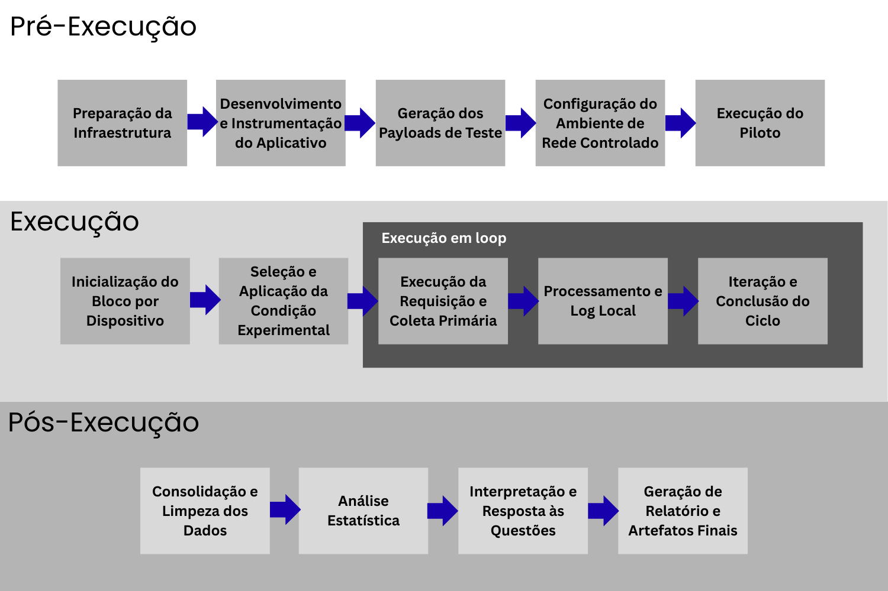

# **Plano de Experimento – Identificação Básica, Contexto e Problema**  
### *Análise Experimental da Compactação de Payloads em Aplicações Mobile*

---

## **1. Identificação Básica**

### **1.1 Título do Experimento**
**Análise Experimental da Compactação de Payloads em Aplicações Mobile: impacto em consumo de dados, latência e desempenho**

### **1.2 ID / Código**
**EXP-COMP-MOBILE-001**

### **1.3 Versão do Documento e Histórico de Revisão**
| Versão | Data | Descrição |
|-------|------|-----------|
| **v1.0** | 22/11/2025 | Versão inicial da Identificação, Contexto e Problema |

### **1.4 Datas**
- **Criação:** 22/11/2025  
- **Última atualização:** 22/11/2025

### **1.5 Autores**
- **Nome:** *Thiago Vitor Pereira Perdigão*  
  **Área:** Engenharia de Software  
  **Contato:** *thiagovperdigao@gmail.com*

### **1.6 Responsável Principal (PI)**
- **Thiago Vitor Pereira Perdigão**

### **1.7 Projeto / Produto / Iniciativa Relacionada**
Este estudo integra um projeto aplicado de avaliação de desempenho em aplicações mobile, com ênfase na eficiência da transmissão de dados e no uso racional de recursos de rede. O experimento fornece fundamentos técnicos que podem orientar decisões de arquitetura e otimização em produtos mobile modernos.

---

## **2. Contexto e Problema**

### **2.1 Descrição do Problema / Oportunidade**
Aplicações mobile trocam dados com servidores frequentemente por meio de payloads JSON. O volume de dados transmitidos afeta:

- **consumo de dados do usuário**,  
- **latência percebida**,  
- **uso de CPU para descompressão**,  
- **comportamento sob redes móveis instáveis (3G/4G/5G)**.

Apesar da disponibilidade de vários algoritmos (gzip, brotli, zstd), sua adoção em mobile ainda carece de evidências empíricas consistentes. Os impactos variam com:

- tamanho do payload,  
- condição da rede,  
- capacidade do dispositivo,  
- custo computacional da operação.

Assim, permanece a questão: **qual algoritmo de compactação oferece o melhor equilíbrio entre redução de latência, economia de dados e baixo overhead de CPU para payloads JSON em aplicações mobile, considerando diferentes tamanhos de payload e condições de rede?**  
Este experimento busca fornecer dados controlados e reproduzíveis para responder a essa pergunta.

---

### **2.2 Contexto Organizacional e Técnico**
O estudo será conduzido em ambiente acadêmico, com:

- **Aplicação Android (>= 10)** criada exclusivamente para testes;  
- **Servidor** configurado com none/gzip/brotli/zstd;  
- **Simulação de rede** (tc, Network Link Conditioner);  
- **Medição de CPU** via Android Profiler e ADB;  
- **Coleta automatizada** em CSV.

O ambiente permite controle rigoroso de variáveis e repetibilidade experimental.

---

## **2.3 Trabalhos e Evidências Prévias (Internos e Externos)**

Literatura técnica e científica relata que:

- **gzip** oferece bom equilíbrio, mas taxa de compressão limitada para JSON (Jones et al., 2019).  
- **brotli** alcança maior taxa de compressão, porém com custo computacional mais elevado (Alakuijala & Szabadka, 2016).  
- **zstd** obtém alta taxa de compressão com excelente velocidade (Collet, 2021).  
- Redução de bytes impacta fortemente a latência em redes móveis (Ying et al., 2020; Zhang & Ren, 2022).  
- CPU tem grande impacto no tempo de resposta em dispositivos mobile (Kim et al., 2021; Liu et al., 2020).

Poucos trabalhos, entretanto, avaliam esses algoritmos em cenários mobile reais, combinando rede, CPU e variação de payload — lacuna que este estudo busca suprir.

---

## **2.4 Referencial Teórico e Empírico Essencial**

### **a) Teoria da Compactação**
- **LZ77/LZ78** — algoritmos fundamentais para gzip e derivados (Ziv & Lempel, 1977).  
- **Huffman Coding** — usado em praticamente todos os algoritmos de compressão (Huffman, 1952).  
- **Brotli** — compressão baseada em dicionário estático otimizado (Alakuijala & Szabadka, 2016).  
- **Zstandard** — combinação de dicionários dinâmicos + FSE/Huffman (Collet, 2021).

### **b) Desempenho em Redes Móveis**
- Modelos de latência e throughput em redes móveis (Wang et al., 2018; Feamster & Livingood, 2019).  
- Variação temporal e instabilidade de redes celulares (Kakhki et al., 2020).

### **c) Engenharia de Desempenho Mobile**
- Overhead de CPU em dispositivos Android (Liu et al., 2020; Kim et al., 2021).  
- Parsing e descompressão em payloads estruturados (Xu et al., 2019; Zhang & Ren, 2022).

### **d) Metodologia Experimental**
- GQM (Basili et al., 1994).  
- ANOVA e métodos estatísticos aplicados à engenharia de software (Juristo & Moreno, 2010).  
- Diretrizes para experimentação controlada (Wohlin et al., 2012).

---

# **3. Objetivos e Questões (GQM)**

## **3.1 Objetivo Geral (Template GQM)**
**Analisar** o impacto de diferentes algoritmos de compactação (gzip, brotli e zstd)  
**com o propósito de** avaliar sua efetividade em reduzir latência, consumo de dados e overhead de CPU  
**sob a perspectiva de** desenvolvedores e engenheiros de desempenho  
**no contexto de** aplicações mobile Android realizando requisições JSON em redes móveis variáveis.

---

## **3.2 Objetivos Específicos**

- **O1.** Avaliar o impacto dos algoritmos de compactação na *latência total* das requisições.
- **O2.** Comparar a *taxa de redução do tamanho do payload* entre os algoritmos.
- **O3.** Medir o *overhead de CPU* causado pelas etapas de compressão e descompressão.
- **O4.** Avaliar o impacto da compactação no desempenho sob *diferentes condições de rede* (boa, média, degradada).

---

## **3.3 Questões de Pesquisa**

### **Objetivo O1 — Latência**
- **Q1.1:** A compactação reduz a latência total das requisições?  
- **Q1.2:** Qual algoritmo apresenta menor latência sob payloads pequenos, médios e grandes?  
- **Q1.3:** Como a latência varia entre redes 3G, 4G e Wi-Fi?

### **Objetivo O2 — Redução de Tamanho**
- **Q2.1:** Qual algoritmo gera maior taxa de compressão?  
- **Q2.2:** A taxa de compressão varia com o tamanho do payload JSON?  
- **Q2.3:** Existe relação entre taxa de compressão e latência obtida?

### **Objetivo O3 — Overhead de CPU**
- **Q3.1:** Qual algoritmo possui menor custo de CPU no device?  
- **Q3.2:** O custo de CPU varia com o tamanho do payload?  
- **Q3.3:** A descompressão representa maior custo que a compressão?

### **Objetivo O4 — Robustez sob diferentes redes**
- **Q4.1:** Quais algoritmos mantêm desempenho estável em redes instáveis?  
- **Q4.2:** A compactação melhora a performance em redes degradadas?  
- **Q4.3:** Existe diferença significativa entre algoritmos quando há perda de pacotes?

---

## **3.4 Tabela GQM**

| **Objetivo** | **Pergunta** | **Métricas Associadas** |
|--------------|--------------|--------------------------|
| O1 | Q1.1 | M1 Latência total; M2 Tempo de resposta (RTT) |
| O1 | Q1.2 | M1 Latência total; M3 Desvio padrão da latência |
| O1 | Q1.3 | M1 Latência total; M4 Tempo de conexão |
| O2 | Q2.1 | M5 Tamanho comprimido; M6 Taxa de compressão (%) |
| O2 | Q2.2 | M5 Tamanho comprimido; M7 Tamanho original |
| O2 | Q2.3 | M6 Taxa de compressão; M1 Latência total |
| O3 | Q3.1 | M8 CPU utilização (%); M9 Tempo de descompressão |
| O3 | Q3.2 | M8 CPU utilização; M10 Tempo de compressão |
| O3 | Q3.3 | M9 Tempo de descompressão; M10 Tempo de compressão |
| O4 | Q4.1 | M1 Latência; M11 Variação de latência |
| O4 | Q4.2 | M1 Latência; M12 Throughput efetivo |
| O4 | Q4.3 | M11 Variação de latência; M5 Tamanho comprimido |

---

## **3.5 Tabela de Métricas (Descrição e Unidade)**

| **Código** | **Descrição da Métrica** | **Unidade** |
|-----------|---------------------------|-------------|
| **M1** | Latência total medida do app ao servidor (request → response) | ms |
| **M2** | RTT (Round Trip Time) médio por requisição | ms |
| **M3** | Desvio padrão da latência entre execuções | ms |
| **M4** | Tempo até o estabelecimento da conexão | ms |
| **M5** | Tamanho do payload comprimido | bytes |
| **M6** | Taxa de compressão = (1 - M5/M7) | % |
| **M7** | Tamanho do payload original (sem compressão) | bytes |
| **M8** | Utilização de CPU durante compressão/descompressão | % |
| **M9** | Tempo de descompressão do payload | ms |
| **M10** | Tempo de compressão do payload | ms |
| **M11** | Variação de latência entre tentativas consecutivas | ms |
| **M12** | Throughput efetivo sob condição de rede medida | kbps |

---

# 4. Escopo e Contexto do Experimento

## 4.1 Escopo Funcional / de Processo (Incluído e Excluído)

**Incluído:**
- Comunicação entre aplicação Android e servidor via HTTP(S).
- Envio e recebimento de payloads JSON de tamanhos variados (pequeno, médio e grande).
- Execução dos algoritmos de compactação: **none (controle), gzip, brotli, zstd**.
- Medições de desempenho: latência, tamanho do payload, uso de CPU na descompressão.
- Simulação de redes móveis (3G, 4G, 5G e Wi-Fi).
- Execução automatizada e coleta de logs/CSV.

**Excluído:**
- Consumo de bateria (explicitamente fora do escopo).
- Dispositivos iOS.
- Protocolos distintos de JSON/HTTP (por exemplo, gRPC, Protobuf).
- Compactação aplicada apenas no servidor sem descompressão no cliente.
- Avaliação de segurança ou cifragem de payloads.

---

## 4.2 Contexto do Estudo
- Experimento conduzido em ambiente acadêmico, no contexto de um TCC.
- Aplicação Android desenvolvida exclusivamente para testes controlados.
- Estudo não envolve usuários finais, apenas execução automatizada.
- Infraestrutura composta por um servidor Linux com suporte a múltiplos algoritmos de compressão.

---

## 4.3 Premissas
- Os ambientes Android e servidor estarão estáveis durante todo o experimento.
- As ferramentas de medição de CPU e latência (ADB, Android Profiler) funcionarão corretamente.
- A simulação de rede (tc/Network Link Conditioner) reproduzirá condições realistas.
- O volume de payloads será suficiente para gerar diferenças estatisticamente relevantes.
- Todos os scripts e instrumentos serão testados previamente no piloto.

---

## 4.4 Restrições
- Tempo limitado para execução e repetição de múltiplos cenários de rede.
- Capacidade de hardware limitada ao dispositivo Android disponível.
- Apenas algoritmos gzip, brotli e zstd serão avaliados — exclusões por tempo e recursos.
- Execução de testes sob uma única versão do Android (>=10).
- Apenas payloads JSON estruturados — não serão testados binários, imagens ou outros formatos.

---

## 4.5 Limitações Previstas
- Resultados podem não generalizar para:
  - Aplicativos iOS.
  - Aplicações que usam Protobuf, Avro ou outros formatos binários.
  - Redes reais com maior variabilidade do que a simulada.
- A CPU específica do dispositivo pode influenciar significativamente os tempos.
- A análise considera apenas um modelo de smartphone — limita a validade externa.

---

# 5. Stakeholders e Impacto Esperado

## 5.1 Stakeholders Principais
- **Autor/Pesquisador (PI)** – execução, análise e documentação.
- **Orientador Acadêmico** – validação científica.
- **Desenvolvedores Mobile** – potenciais usuários dos resultados.
- **Arquitetos de Software** – decisões sobre pipelines e arquitetura de rede.
- **Equipes de Produto** – impacto em UX (latência percebida).
- **Comunidade Acadêmica** – replicação e benchmarking.

---

## 5.2 Interesses e Expectativas dos Stakeholders

| Stakeholder | Interesse / Expectativa |
|------------|--------------------------|
| Pesquisador (PI) | Resultados estatisticamente válidos; execução reprodutível. |
| Orientador | Rigor metodológico; validade interna e externa. |
| Devs Mobile | Diretrizes práticas sobre quando usar compactação. |
| Arquitetos | Evidências para escolha de algoritmos e padrões de API. |
| Produto | Redução de latência e consumo de dados, melhor experiência do usuário. |
| Comunidade Acadêmica | Experimento claro, replicável e bem documentado. |

---

## 5.3 Impactos Potenciais no Processo / Produto
- Possível identificação de algoritmos inadequados para determinados tamanhos de payload.
- Orientações para melhorar desempenho em redes móveis.
- Potencial redução de latência percebida em aplicativos reais.
- Fornecimento de dados para otimização de APIs e padrões de backend.
- Impacto futuro em decisões arquiteturais e políticas de compressão.

---

# 6. Riscos de Alto Nível, Premissas e Critérios de Sucesso

## 6.1 Riscos de Alto Nível
| Tipo | Risco | Mitigação |
|------|--------|-----------|
| Técnico | Falha nas ferramentas de simulação de rede (tc/NLC). | Validar tudo no piloto; usar alternativas caso necessário. |
| Técnico | Inconsistência nas medições de CPU. | Coletar múltiplas repetições; descartar outliers. |
| Operacional | Tempo insuficiente para executar todos os cenários. | Priorizar cenários críticos; automatizar 100% das execuções. |
| Científico | Diferenças pequenas demais para detectar. | Aumentar repetições; avaliar tamanho de efeito. |
| Contexto | Dependência de apenas um dispositivo Android. | Documentar limitações e realizar múltiplas execuções para estabilidade. |

---

## 6.2 Critérios de Sucesso Globais (Go / No-Go)
O experimento será considerado bem-sucedido se:

- Todas as métricas forem coletadas de forma consistente e sem perdas.
- Cada cenário de rede × tamanho de payload × algoritmo for executado pelo menos N vezes (definido no desenho estatístico).
- For possível responder a todas as questões GQM com evidências quantitativas.
- Houver condições claras para comparar os algoritmos e gerar conclusões válidas.

---

## 6.3 Critérios de Parada Antecipada
O experimento deve ser interrompido **antes da execução** se ocorrer:

- Falha na instrumentação que impeça medições de CPU ou latência.
- Inconsistência grave na simulação de rede.
- Problemas éticos, legais ou de infraestrutura.
- Tempo total estimado ultrapassar o cronograma máximo permitido.
- Dados inconsistentes no piloto indicando inviabilidade de execução real.

---

# 7. Modelo Conceitual e Hipóteses

## 7.1 Modelo conceitual (texto)
O modelo conceitual presume que **o algoritmo de compressão** (nenhum, gzip, brotli, zstd) e **o contexto de execução** (tamanho do payload e qualidade da rede) influenciam diretamente três respostas principais no cliente mobile:

- **Latência total da requisição** — afetada por bytes transmitidos (quanto menos bytes, menor tempo de transmissão em redes limitadas) e pelo tempo de CPU para descompressão (quanto maior o custo de CPU, maior o tempo no cliente);
- **Consumo de dados (bytes transmitidos)** — reduzido pela eficiência do algoritmo de compressão;
- **Custo computacional (CPU / tempo de descompressão)** — determinado pela complexidade do algoritmo e pela implementação no cliente.

Esses efeitos interagem: por exemplo, um algoritmo com excelente taxa de compressão (brotli) reduz bytes mas pode aumentar o tempo de descompressão no cliente; em redes lentas a redução de bytes pode compensar esse overhead. Assim, o experimento mede trade-offs entre *bytes ⇄ latência ⇄ CPU* e como estes variam com **tamanho do payload** (pequeno, médio, grande) e **condição de rede** (3G/4G/5G/Wi-Fi).

---

## 7.2 Hipóteses formais (H₀ / H₁)

> **Configuração estatística geral:** para cada questão principal usaremos testes comparativos entre grupos (ANOVA / Kruskal-Wallis) e, quando apropriado, comparações pareadas com correção (post-hoc Tukey ou Wilcoxon com Bonferroni). Nível de significância α = **0,05**.

### Hipóteses relacionadas à latência (ligadas a O1 / Q1.*)
- **H0(L1):** Não há diferença significativa na latência total média entre os algoritmos {none, gzip, brotli, zstd} sob uma dada condição de rede e tamanho de payload.  
- **H1(L1):** Pelo menos um algoritmo difere significativamente na latência total média.

- **H0(L2):** A latência média de brotli = latência média de zstd = latência média de gzip.  
- **H1(L2):** Latências médias entre esses algoritmos não são todas iguais (direção a ser verificada nos testes post-hoc).

- **H0(L3):** Em redes lentas (3G), a redução de bytes não altera significativamente o tempo total percebido.  
- **H1(L3):** Em redes lentas (3G), a redução de bytes causada por compressão reduz significativamente o tempo total percebido.

### Hipóteses relacionadas ao consumo de dados (ligadas a O2 / Q2.*)
- **H0(D1):** Não há diferença significativa no tamanho médio compactado entre gzip, brotli e zstd.  
- **H1(D1):** Ao menos um algoritmo apresenta diferente tamanho compactado médio.

- **H0(D2):** A taxa de compressão é independente do tamanho do payload.  
- **H1(D2):** A taxa de compressão varia com o tamanho do payload (pequeno/médio/grande).

### Hipóteses relacionadas ao custo de CPU (ligadas a O3 / Q3.*)
- **H0(C1):** Não há diferença significativa no uso médio de CPU durante a descompressão entre os algoritmos.  
- **H1(C1):** Há diferença significativa no uso médio de CPU.

- **H0(C2):** O tempo de descompressão não contribui significativamente para a latência total.  
- **H1(C2):** O tempo de descompressão contribui significativamente para a latência total.

### Hipóteses relacionadas ao tamanho do payload (ligadas a O4 / Q4.*)
- **H0(S1):** O efeito do algoritmo sobre latência/bytes/CPU não depende do tamanho do payload (efeito aditivo sem interação).  
- **H1(S1):** Existe interação entre algoritmo e tamanho do payload (efeito dependente do tamanho).

---

## 7.3 Nível de significância e considerações de poder
- **α (nível de significância):** 0,05.  
- **Poder desejado (1 − β):** 0,80 (alvo), indicando probabilidade de detectar efeitos relevantes.  
- **Consideração prática sobre tamanho de amostra:** antes do experimento completo será realizado um **piloto** (R = 10 repetições por combinação) para estimar o desvio-padrão e o tamanho de efeito. Com base nisso será feito um cálculo formal de tamanho de amostra (ex.: ANOVA one-way/fatorial).  
- **Recomendação preliminar:** planejar **mínimo R = 30** repetições por combinação (celular de fator) como base prática; se o piloto indicar efeito médio (f ≈ 0,25), pode ser necessário aumentar para ≈ 40–50 repetições por célula para alcançar poder 0,8 em ANOVA fatorial.

---

# 8. Variáveis, Fatores, Tratamentos e Objetos de Estudo

## 8.1 Objetos de estudo
- **Endpoint(s) do servidor** que retornam payloads JSON idênticos para cada condição de compressão.  
- **App Android de teste** que executa requisições, descomprime (se aplicável), mede tempos, captura uso CPU e grava logs/CSV.  
- **Payloads JSON** (coleção de arquivos/strings) categorizados como: pequeno (5–20 KB), médio (50–200 KB), grande (500 KB–2 MB).  
- **Ambiente de rede** (simulador tc / Network Link Conditioner ou rede real).

---

## 8.2 Visão geral de sujeitos / participantes
- **Participantes humanos:** nenhum (execução automatizada).  
- **Dispositivos:** 1–3 dispositivos Android representativos (mínimo um device de referência; ideal ter dois adicionais para validação externa).  
- **Operadores:** pesquisador que dispara os scripts e monitora execução.

---

## 8.3 Variáveis (tabela)

| Código | Variável | Tipo | Descrição |
|--------|---------:|------|-----------|
| V1 | Algoritmo de compressão | Independente (fator) | Níveis: none, gzip, brotli, zstd |
| V2 | Tamanho do payload | Independente (fator) | Níveis: pequeno, médio, grande |
| V3 | Condição de rede | Independente (fator) | Níveis: 3G, 4G, 5G, Wi-Fi |
| V4 | Latência total (M1) | Dependente | Tempo request→response (ms) |
| V5 | RTT (M2) | Dependente | ms |
| V6 | Latência de download (M3) | Dependente | ms |
| V7 | Tamanho compactado (M8) | Dependente | bytes |
| V8 | Taxa de compressão (M9) | Dependente | proporção |
| V9 | Uso de CPU durante descompressão (M10) | Dependente | % |
| V10 | Tempo de descompressão (M11) | Dependente | ms |
| V11 | Throughput efetivo (M14) | Dependente | kB/s |
| V12 | Dispositivo | Controle / bloqueio | Modelo e especificação do hardware (mantido ou usado em blocos) |
| V13 | Ordem de execução | Variável de bloqueio | Nivel a ser randomizado/contrabalançado |

---

## 8.4 Fatores, Níveis e Tratamentos (tabela com combinações)

**Fatores principais:**
- **F1 – Algoritmo (4 níveis):** none, gzip, brotli, zstd  
- **F2 – Tamanho do payload (3 níveis):** pequeno, médio, grande  
- **F3 – Condição de rede (4 níveis):** 3G, 4G, 5G, Wi-Fi  
- **F4 – Dispositivo (bloqueio; 1–3 níveis):** Device A (referência), Device B (opcional), Device C (opcional)

**Tratamentos e combinações:**

| ID  | Algoritmo | Payload | Rede |
|-----|-----------|---------|------|
| T25 | none      | pequeno | 5G   |
| T26 | gzip      | pequeno | 5G   |
| T27 | brotli    | pequeno | 5G   |
| T28 | zstd      | pequeno | 5G   |
| T29 | none      | médio   | 5G   |
| T30 | gzip      | médio   | 5G   |
| T31 | brotli    | médio   | 5G   |
| T32 | zstd      | médio   | 5G   |
| T33 | none      | grande  | 5G   |
| T34 | gzip      | grande  | 5G   |
| T35 | brotli    | grande  | 5G   |
| T36 | zstd      | grande  | 5G   |

> **Número de células no fatorial completo (por dispositivo):** 4 (algoritmos) × 3 (tamanhos) × 4 (redes) = **48 combinações** por dispositivo.  
> Com R repetições planejadas por combinação, total de execuções = 48 × R × número_de_dispositivos.

---

## 8.5 Variáveis dependentes (resumo)
As respostas principais a serem medidas e analisadas: Latência Total, RTT, Latência de Download, Tamanho Compactado, Taxa de Compressão, Uso de CPU, Tempo de Descompressão, Throughput.

---

## 8.6 Variáveis de controle / bloqueio
- **Dispositivo (hardware)** — idealmente usar blocos por dispositivo para controlar efeito do hardware.  
- **Versão do app** — manter única e imutável durante coleta.  
- **Ambiente do servidor** — mesmo servidor/instância para todas as execuções.  
- **Hora do dia** — randomizar execuções ou bloquear por janela para reduzir efeito de tráfego externo.  
- **Cache** — desabilitado no cliente e no servidor para evitar efeitos de cache.

---

## 8.7 Possíveis variáveis de confusão conhecidas
- **Variações inesperadas na rede real** (quando usadas) — mitigar priorizando rede simulada.  
- **Processos concorrentes no dispositivo** (background jobs) — mitigar com device em modo avião com apenas conexão de teste.  
- **Diferenças na implementação do algoritmo** (bibliotecas) — usar implementações bem conhecidas e consistentes entre servidor/cliente.  
- **Retransmissões TCP** — coletar métricas de nível de transporte para identificar e, se necessário, excluir execuções com retransmissões excessivas.

---

# 9. Desenho Experimental

## 9.1 Tipo de desenho
- **Fatorial completo** (3 fatores principais: Algoritmo × Tamanho × Rede) — permite estimar efeitos principais e interações.  
- Justificativa: precisamos avaliar não só diferenças entre algoritmos (efeito principal), mas também como essas diferenças dependem do tamanho do payload e da qualidade da rede (interações).

## 9.2 Randomização e alocação
- **O que será randomizado:** ordem das execuções dentro de cada bloco (por dispositivo), seleção aleatória de payloads dentro de cada categoria (pequeno/médio/grande) quando existir mais de um exemplar.  
- **Como será feita:** scripts de automação gerarão uma lista aleatória seedada (ex.: `python random.shuffle`) para a sequência de execuções e serão reusados os seeds para reprodutibilidade.  
- **Alocação:** cada combinação F1×F2×F3 será executada R vezes por dispositivo; as R execuções serão distribuídas ao longo do tempo e randomizadas para evitar tendência temporal.

## 9.3 Balanceamento e contrabalanço
- **Balanceamento:** o desenho fatorial garante que todos os níveis de fatores sejam representados igualmente. Planejamos executar o mesmo número R de repetições em cada célula do fatorial.  
- **Contrabalanço (order effects):** a ordem de algoritmos será alternada e randomizada; em execuções sequenciais que envolvam múltiplos algoritmos, aplicar um intervalo de “respiro” entre execuções (por exemplo, 5 s) e reiniciar processos críticos para reduzir efeitos residuais.

## 9.4 Número de grupos e sessões
- **Grupos experimentais:** cada **combinação** de fatores é tratada como um "grupo" (total 48 por dispositivo).  
- **Sessões por sujeito/dispositivo:** cada dispositivo executa todas as 48 combinações; pode-se dividir em sessões diárias para evitar sobrecarga: ex.: 2 sessões × 24 combinações.  
- **Repetições (R):** **mínimo R = 30**, recomendado ajustar após piloto.  
- **Justificativa:** R=30 é um bom compromisso prático para estimativas de média/variabilidade; entretanto, o piloto definirá se R deve ser aumentado para atingir poder 0,8 para efeitos menores.

---

## 9.5 Plano de execução prático (resumo passo-a-passo)
1. Preparar payloads e endpoints do servidor (mesmos dados lógicos para cada algoritmo).  
2. Implementar rotinas de medição no app (timestamps, bytes, CPU snapshot antes/durante/descompressão).  
3. Testar e validar pipeline com **piloto**: 10 repetições por célula em um único device.  
4. Estimar desvios e recalcular R via análise de poder; ajustar R se necessário.  
5. Executar experimento fatorial completo por dispositivo, com randomização da ordem.  
6. Agregar CSVs, aplicar limpeza (remover execuções com falha ou retransmissões anômalas), e então análise estatística.

---

## 9.6 Considerações sobre análises estatísticas previstas (resumo)
- **Testes para diferenças entre algoritmos:** ANOVA fatorial (se pressuposições atendidas) ou Kruskal-Wallis / modelos lineares generalizados caso de não normalidade/heterocedasticidade.  
- **Interações:** avaliar Algoritmo × Tamanho e Algoritmo × Rede via ANOVA fatorial; modelagem com regressão multivariada para controlar covariáveis (por exemplo, RTT).  
- **Comparações pareadas / post-hoc:** Tukey HSD (ANOVA) ou Dunn test com correção (não paramétricos).  
- **Efeitos de dimensão:** apresentar médias, intervalos de confiança (95%) e tamanhos de efeito (Cohen’s d ou f).

---

## 9.7 Exemplo de cálculo aproximado de esforço (execuções)
- **Células por dispositivo:** 48  
- **R (repetições) planejado:** 30 (mínimo)  
- **Execuções por dispositivo:** 48 × 30 = **1.440 requisições**  
- **Com 1 device de referência:** 1.440 requisições ≈ executáveis em horas/dias dependendo da latência e intervalos; automatizar para rodar continuamente com checkpoints.

---

# 10. População, Sujeitos e Amostragem
### *Amostragem de Sistemas Android para Análise de Desempenho*

---

## 10.1 População-alvo
A população-alvo deste estudo não são humanos, mas sistemas computacionais representativos do ecossistema mobile Android. Mais especificamente, o experimento visa gerar conclusões aplicáveis a aplicações Android nativas que consomem APIs RESTful com payloads JSON em redes celulares.

---

## 10.2 Critérios de inclusão de sujeitos

| **Critério** | **Descrição** |
|--------------|---------------|
| **Dispositivos** | Smartphones Android com versão do sistema >= 10. |
| **Hardware** | Deve possuir capacidade de hardware para executar descompressão de software sem aceleração dedicada. |
| **Conectividade** | Deve suportar conexões Wi-Fi e, idealmente, ter capacidade para redes celulares para testes em cenários reais (opcional). |
| **Estado** | Deve poder ser reiniciado e ter seus processos de background controlados para garantir um ambiente de teste limpo. |

---

## 10.3 Critérios de exclusão de sujeitos

- Dispositivos com root ou modificações de firmware que alterem significativamente o comportamento da rede ou do sistema.
- Dispositivos com defeitos conhecidos de hardware que afetem o desempenho da CPU ou da rede.
- Emuladores Android, pois seu desempenho de rede e CPU não reflete com precisão o de hardware real.

---

## 10.4 Tamanho da amostra planejado (por grupo)

| **Componente** | **Planejamento** | **Justificativa/Detalhes** |
|----------------|------------------|----------------------------|
| **Sujeitos (Dispositivos)** | 1 dispositivo como referência principal. A inclusão de um segundo dispositivo (modelo diferente) é altamente desejável. | Restrição de recursos. O segundo modelo visa uma verificação preliminar de validade externa. |
| **Repetições (Unidades Experimentais - R)** | Mínimo de 30 repetições por combinação experimental. | Cálculo final será ajustado após o piloto para atingir um poder estatístico (1-β) de pelo menos 0,80 para efeitos de tamanho médio. |

---

## 10.5 Método de seleção / recrutamento

| **Método** | **Descrição** | **Justificativa** |
|------------|---------------|-------------------|
| **Amostra de conveniência** | Os dispositivos serão os disponíveis ao pesquisador (PI). O dispositivo principal será selecionado por ser um modelo intermediário/comum no mercado. | Dada a natureza técnica do experimento (sem participantes humanos) e as restrições de recursos, uma amostra de conveniência de dispositivos é aceitável, desde que as limitações sejam claramente documentadas. |

---

## 10.6 Treinamento e preparação dos sujeitos

| **Etapa** | **Procedimento** |
|-----------|------------------|
| **Preparação do Dispositivo** | Procedimento padrão antes de cada sessão: reinicialização, desabilitação de atualizações automáticas, fechamento de apps em background e ativação do modo avião (com apenas a interface de teste de rede reativada). |
| **Automação** | Um script automatizado (via ADB) será usado sempre que possível para garantir a consistência do estado inicial do dispositivo. |

---

## 10.7 Fluxo do experimento

# Fluxograma Operacional - Detalhamento por Passo

A Tabela abaixo apresenta todas as etapas do experimento, os instrumentos envolvidos, as decisões operacionais e a relação entre cada passo e as variáveis do estudo. Este fluxograma assegura padronização, controle de variáveis de confusão e rastreabilidade completa da execução.

| Fase | Nº | Título do Passo | Atividade Detalhada | Instrumentos / Objeto / Stakeholders |
|------|----|------------------|---------------------|---------------------------------------|
| **Pré-Execução** | 1 | **Preparação da Infraestrutura** | Configurar o servidor Linux com endpoints distintos (APIs) para cada um dos algoritmos de compressão a serem testados: `none` (sem compressão), `gzip`, `brotli` e `zstd`. | **Instrumento:** Servidor Linux. **Variável Independente (V1):** Algoritmo de Compressão. |
| | 2 | **Desenvolvimento e Instrumentação do Aplicativo** | Desenvolver o aplicativo Android de teste que integra bibliotecas para descompressão dos algoritmos e módulos de logging. O app deve ser capaz de capturar e registrar automaticamente todas as 12 métricas definidas (M1 a M12). | **Instrumento:** Aplicativo Android. **Métricas:** Implementação de M1 a M12 para coleta. |
| | 3 | **Geração dos Payloads de Teste** | Criar e validar um conjunto de payloads no formato JSON, categorizados em três tamanhos distintos: Pequeno (~1KB), Médio (~10KB) e Grande (~100KB). Estes serão os dados transmitidos. | **Objeto de Estudo:** Payloads JSON. **Variável Independente (V2):** Tamanho do Payload. |
| | 4 | **Configuração do Ambiente de Rede Controlado** | Configurar um simulador de rede (como `tc` no Linux ou Network Link Conditioner) para emular as condições de latência, jitter e perda de pacotes dos perfis de rede: 3G, 4G, 5G e Wi-Fi (ótimas condições). | **Instrumento:** Simulador de rede. **Variável Independente (V3):** Condição de Rede. |
| | 5 | **Execução do Piloto** | Realizar uma execução preliminar com um subconjunto do experimento (ex: 10 repetições para algumas combinações) no dispositivo principal. Objetivo: validar a instrumentação, a coleta de dados e a estabilidade do ambiente. | **Stakeholders:** Pesquisador Principal (PI) e Orientador. **Decisão:** Verificar consistência dos dados para prosseguir. |
| **Execução** | 6 | **Inicialização do Bloco por Dispositivo** | Preparar o dispositivo móvel para o teste: ativar modo avião, conectar apenas à rede Wi-Fi de teste, fechar todos os aplicativos em segundo plano. Este passo visa controlar variáveis de confusão. | **Variável de Bloqueio (V12):** Dispositivo (cada um é um bloco no experimento). |
| | 7 | **Seleção e Aplicação da Condição Experimental** | Um script mestre, seguindo uma ordem randomizada, seleciona a próxima combinação única de fatores: Algoritmo (V1) + Tamanho de Payload (V2) + Condição de Rede (V3). Aplica a configuração de rede no simulador. | **Variável Controlada (V13):** Ordem de Execução (randomizada). |
| | 8 | **Execução da Requisição e Coleta Primária** | O app Android dispara uma requisição HTTP(S) para o endpoint do servidor correspondente ao algoritmo. Cronometra o ciclo completo request-response. Registra timestamps, tamanho dos dados e inicia o monitor de CPU do sistema. | **Objeto de Estudo:** Endpoint do servidor. **Coleta Primária:** M1, M2, M3 (latências), M5, M7 (tamanhos), M8 (CPU). |
| | 9 | **Processamento e Log Local** | O app calcula métricas derivadas, como a Taxa de Compressão (M6), a partir dos dados brutos. Em seguida, grava todas as métricas dessa execução, juntamente com os metadados da condição experimental (V1, V2, V3, V12), em um arquivo CSV local no dispositivo. | **Atividade:** Cálculo de métricas e persistência local. |
| | 10| **Iteração e Conclusão do Ciclo** | Verifica se foram realizadas as `R` repetições (ex: 30) para a combinação atual. Se não, volta ao passo 8. Se sim, verifica se todas as 48 combinações (4 alg * 3 tam * 4 rede) foram executadas naquele dispositivo. Se não, volta ao passo 7. Se sim, encerra a coleta no dispositivo. | **Lógica de Controle:** Garantir o número adequado de repetições e a cobertura de todas as combinações experimentais. |
| **Pós-Execução** | 11| **Consolidação e Limpeza dos Dados** | Agregar todos os arquivos CSV de todos os dispositivos em um único conjunto de dados (dataset). Realizar limpeza: remover execuções com falha de conexão e outliers extremos baseados em regras pré-definidas (ex: latência total maior que 30 segundos). | **Stakeholder Envolvido:** PI (como analista). |
| | 12| **Análise Estatística** | **12.1 (Descritiva):** Calcular estatísticas sumárias (média, mediana, desvio padrão, IC) para cada métrica, agrupando por condição experimental. Gerar gráficos exploratórios (boxplots, barras). **12.2 (Inferencial):** Aplicar os testes de hipóteses planejados, como ANOVA fatorial para testar os efeitos principais e de interação, seguidos de testes post-hoc (ex: Tukey) para comparações detalhadas. Usar nível de significância α=0.05. | **Atividades:** Estatística descritiva e inferencial para testar as hipóteses. |
| | 13| **Interpretação e Resposta às Questões** | Interpretar os resultados dos testes estatísticos e as tendências observadas nos gráficos para responder formalmente a cada uma das Questões de Pesquisa (Q1.1 a Q4.3) definidas no modelo GQM. | **Stakeholders:** PI e Orientador para validação científica das conclusões. |
| | 14| **Geração de Relatório e Artefatos Finais** | Redigir o relatório técnico/acadêmico completo com metodologia, resultados, discussão e conclusões. Organizar e publicar o dataset anônimo, os scripts de automação da coleta e os scripts de análise em um repositório público para garantir a reprodutibilidade do estudo. | **Stakeholders Impactados:** Comunidade Acadêmica (replicação) e Desenvolvedores/Arquitetos (aplicação das diretrizes práticas). |

# 11. Instrumentação e Protocolo Operacional
### *Infraestrutura e Procedimentos de Execução*

---

## **11.1 Instrumentos de coleta**

| **Instrumento** | **Função Principal** | **Saída/Detalhes** |
|-----------------|----------------------|-------------------|
| **Aplicativo Android Instrumentado (App Logger)** | Coletar timestamps de início/fim, tamanho do payload recebido e acionar coleta de CPU. | Arquivo CSV local. |
| **Android Profiler / ADB** (`dumpsys cpuinfo`, `/proc/stat`) | Obter a utilização percentual da CPU pelo processo do app durante a janela de descompressão. | Acionado via script. |
| **Servidor Web** (Nginx/Apache com módulos) | Servir os payloads e aplicar a compressão no lado do servidor. | Loga o algoritmo utilizado e o tamanho do payload enviado. |
| **Scripts de Automação** (Python/Bash) | Orquestrar a sequência experimental: alterar configurações de rede, randomizar ordem, iniciar app, coletar logs via ADB e consolidar dados. | Controla todo o fluxo do experimento. |
| **Ferramenta de Simulação de Rede** (`tc` no Linux) | Emular latência, jitter, perda de pacotes e largura de banda das redes 3G/4G/5G. | Cria ambiente de rede controlado e reprodutível. |

---

## 11.2 Materiais de suporte

| **Material** | **Finalidade** |
|--------------|----------------|
| **Manual do Operador** | Documento com comandos exatos para inicializar cada ferramenta, iniciar a coleta e lidar com falhas comuns. |
| **Planilha de Rastreamento de Execuções** | Template para registro manual (backup) do progresso (ID da combinação, horário, observações). |

---

## 11.3 Procedimento experimental (protocolo – visão passo a passo)

| **Fase** | **Passos** |
|----------|------------|
| **Pré-Sessão** (30 min antes) | 1. Ligar e configurar servidor. 2. Reiniciar dispositivo de teste. 3. Executar script de preparo do dispositivo (limpeza de cache, kill de processos). |
| **Início da Sessão** | No computador de controle, executar o **Script Mestre**. |
| **Para cada execução (automática)** | a. Seleciona a próxima combinação (Algoritmo, Tamanho, Rede) da lista randomizada. b. Configura o perfil de rede correspondente no simulador. c. Envia comando broadcast ao app para iniciar a requisição configurada. d. App executa a requisição, coleta dados e salva em CSV. e. Script aguarda intervalo fixo de 5 segundos (cool-down). f. Repete do passo (a) até completar as R repetições da combinação. |
| **Pós-Sessão Diária** | Script consolida os CSVs do dia em um arquivo único e faz backup. |
| **Ao Final de Todas as Sessões** | Agregar todos os arquivos de backup no dataset final. |

---

## 11.4 Plano de piloto

| **Aspecto** | **Detalhamento** |
|-------------|------------------|
| **Objetivo** | Validar todo o pipeline de coleta, estimar variabilidade das métricas e identificar falhas no protocolo. |
| **Escopo** | Executar **R=10** repetições para um subconjunto de **8 combinações** (2 algoritmos × 2 tamanhos × 2 redes) no dispositivo principal. |
| **Critérios de Ajuste** | - **Variância da latência >50% da média:** Investigar e estabilizar ambiente de rede. - **Falha na coleta de CPU >20%:** Revisar instrumentação do app. - **Tempo total muito superior ao planejado:** Considerar reduzir R após recálculo do poder estatístico. |

---

# 12. Plano de Análise de Dados (Pré-Execução)
### *Estratégia e Métodos Estatísticos*

---

## 12.1 Estratégia geral de análise
Cada **Questão (Q)** do GQM será respondida analisando as **Métricas (M)** associadas, comparando os grupos definidos pelos **Fatores (V)**. A análise será feita em dois níveis:
1.  **Descritiva:** apresentando médias e visualizações.
2.  **Inferencial:** aplicando testes estatísticos para generalizar a partir da amostra.

---

## 12.2 Métodos estatísticos planejados

| **Finalidade** | **Método/Teste** | **Condição de Aplicação** |
|----------------|------------------|---------------------------|
| **Pressupostos** | Shapiro-Wilk (normalidade) e Levene (homogeneidade de variâncias). | Aplicados em cada grupo de métricas antes das análises principais. |
| **Análise Principal (3 fatores)** | ANOVA Fatorial de Três Vias (Algoritmo × Tamanho × Rede). | Para métricas contínuas (Latência, CPU) se pressupostos atendidos. Testa efeitos principais e interações. |
| **Análise (pressupostos violados)** | Teste de Kruskal-Wallis seguido do Teste de Dunn com correção de Bonferroni. | Equivalente não paramétrico quando normalidade/homocedasticidade não são atendidas. |
| **Comparações Pareadas** | Teste Post-Hoc de Tukey HSD. | Após uma ANOVA significativa, para identificar diferenças específicas entre algoritmos. |
| **Análise de Correlação** | Coeficiente de correlação de Pearson ou Spearman. | Para explorar relações (ex.: entre taxa de compressão e latência - Q2.3). |
| **Tamanho de Efeito** | η² (eta quadrado) para ANOVAs; d de Cohen para comparações pareadas. | Avalia a significância prática além da estatística. |

---

## 12.3 Tratamento de dados faltantes e outliers

| **Tipo de Dado** | **Procedimento** |
|------------------|------------------|
| **Dados Faltantes** | Execuções com falha por motivo conhecido (ex.: timeout) serão registradas com um *flag* e excluídas da análise principal. A causa será analisada separadamente. |
| **Outliers Univariados** | Valores além de `[Q1 - 3*IQR, Q3 + 3*IQR]` serão inspecionados. Se atribuídos a erros mensuráveis, serão excluídos. Outliers sem causa identificada serão mantidos, e uma **análise de sensibilidade** será realizada com e sem eles. |

---

## 12.4 Plano de análise para dados qualitativos (se houver)
Não há coleta de dados qualitativos (entrevistas, questionários) planejada. Observações qualitativas do operador durante a execução serão registradas em um log e poderão ser usadas para contextualizar ou explicar anomalias quantitativas.

---

# 13. Avaliação de Validade (Ameaças e Mitigação*

---

## 13.1 Validade de conclusão
| **Ameaça** | **Mitigação** |
|------------|---------------|
| Baixo poder estatístico devido a R insuficiente ou variabilidade alta. | Cálculo do tamanho de amostra pós-piloto. Aumentar R conforme necessário. Reportar tamanhos de efeito. |

---

## 13.2 Validade interna
| **Ameaça** | **Categoria** | **Mitigação** |
|------------|---------------|---------------|
| Mudanças no ambiente durante sessão longa (ex.: atualizações em background). | History/Maturation | Reinicialização do dispositivo entre sessões, modo avião e randomização da ordem das execuções. |
| Usar apenas um modelo de dispositivo. | Selection | Documentar como limitação. Incluir um segundo dispositivo se possível. |

---

## 13.3 Validade de constructo
| **Ameaça** | **Mitigação** |
|------------|---------------|
| A "Latência Total" (M1) pode incluir tempo de parsing JSON além do tempo de rede e descompressão. | Isolar o tempo de descompressão (M9) via instrumentação no código. O tempo de parsing será constante entre tratamentos. |

---

## 13.4 Validade externa
| **Ameaça** | **Mitigação** |
|------------|---------------|
| Resultados limitados a JSON, Android e redes simuladas. | Ser explícito sobre o contexto de generalização. Usar payloads com estruturas comuns. Base da simulação em parâmetros de estudos empíricos reais. |

---

## 13.5 Resumo das principais ameaças e estratégias de mitigação

| **Ameaça** | **Categoria** | **Estratégia de Mitigação** |
|------------|---------------|-----------------------------|
| Variabilidade alta da rede | Conclusão/Interna | Rede simulada (controlada); muitas repetições (R). |
| Efeitos de ordem (learning, fatigue) | Interna | Randomização completa da ordem de execução. |
| Implementações diferentes dos algoritmos | Constructo | Usar bibliotecas padrão e amplamente adotadas (ex.: OkHttp, Brotli-Android). |
| Generalização para outros dispositivos | Externa | Usar dispositivo de médio porte comum; documentar especificações; testar em 2 dispositivos se possível. |

---

# 14. Ética, Privacidade e Conformidade

---

## 14.1 Questões éticas
O experimento não envolve participantes humanos, animais ou dados pessoais. Todas as operações são realizadas em dispositivos e servidores controlados pelo pesquisador. Portanto, não há questões éticas diretas relacionadas a sujeitos de pesquisa.

---

## 14.2 Consentimento informado
Não aplicável.

---

## 14.3 Privacidade e proteção de dados

| **Aspecto** | **Detalhamento** |
|-------------|------------------|
| **Dados Coletados** | Dados puramente de desempenho do sistema (latência, CPU, tamanho de arquivo). Payloads JSON contêm dados sintéticos, sem informação pessoal. |
| **Proteção** | Dados armazenados em computador pessoal protegido por senha. Para compartilhamento público, apenas dados anonimizados e agregados serão disponibilizados. |

---

## 14.4 Aprovações necessárias
Considerando o escopo acadêmico, técnico e a ausência de participantes humanos, não é necessária submissão a um Comitê de Ética em Pesquisa (CEP). A aprovação do orientador acadêmico é suficiente para validação metodológica e científica.

---

# 15. Recursos, Infraestrutura e Orçamento

---

## 15.1 Recursos humanos e papéis
| **Papel** | **Responsabilidades** |
|-----------|-----------------------|
| **Pesquisador (PI)** | Executa todas as fases: planejamento, desenvolvimento, operação, análise, redação. |
| **Orientador Acadêmico** | Supervisão metodológica, revisão crítica do plano e dos resultados. |
| **Colegas de Laboratório (Opcional)** | Revisores ad hoc do protocolo. |

---

## 15.2 Infraestrutura técnica necessária
- **Servidor:** Máquina Linux com Nginx/Apache, módulos de compressão (gzip, brotli, zstd) e acesso root para configuração do `tc`.
- **Dispositivo(s) Android:** Pelo menos um smartphone Android (>=10) com depuração USB ativada.
- **Computador de Controle:** Máquina com Android SDK (ADB), Python, e acesso ao servidor e dispositivo.
- **Ponto de Acesso/Roteador:** Para isolar o ambiente de rede.

---

## 15.3 Materiais e insumos
- Cabo USB para conexão ADB.
- Conta em serviço de nuvem (opcional, para servidor).
- Licenças de software: Todas as ferramentas planejadas são open-source ou gratuitas.

---

## 15.4 Orçamento e custos estimados
| **Item** | **Custo Estimado** |
|----------|-------------------|
| **Custo Direto** | Praticamente zero (assumindo posse de dispositivo e computador pessoais, e servidor local). |
| **Custo de Oportunidade (Tempo)** | 80-120 horas de trabalho do PI ao longo de 4-6 semanas. |
| **Custo Potencial (Cloud)** | U$ 20-50 (se for necessária uma instância de nuvem para o servidor). |

---

# 16. Cronograma, Marcos e Riscos Operacionais

---

## 16.1 Macrocronograma (até o início da execução)

| **Semana** | **Atividades Principais** | **Marco** |
|------------|---------------------------|-----------|
| **1** | Finalização deste plano. Desenvolvimento do app e do servidor. | Plano aprovado pelo orientador. |
| **2** | Instrumentação completa (logging, CPU). Configuração do simulador de rede. | App e servidor instrumentados. |
| **3** | Execução do Piloto. Análise dos dados do piloto. Cálculo final de R. | Checkpoint de validação do pipeline. |
| **4** | Ajustes finais no protocolo. Preparação dos scripts de automação final. | Definição de Ready (DoR) atingida. |
| **5** | **INÍCIO DA EXECUÇÃO PRINCIPAL.** | |

---

## 16.2 Dependências entre atividades
- O **Piloto** depende do app, servidor e simulador estarem totalmente funcionais.
- A **Execução Principal** depende da aprovação (Go/No-Go) baseada nos resultados do Piloto.
- A **Análise de Dados** depende da conclusão da coleta de todos os dados planejados.

---

## 16.3 Riscos operacionais e plano de contingência

| **Risco Operacional** | **Probabilidade** | **Impacto** | **Plano de Contingência** |
|-----------------------|-------------------|-------------|---------------------------|
| Dispositivo principal quebra | Baixa | Alto | Usar dispositivo de backup (modelo diferente). Documentar a mudança. |
| Falha prolongada no servidor | Média | Alto | Ter uma imagem do servidor pronta para deploy rápido em outra máquina (local ou cloud). |
| Script de automação apresenta bug que corrompe dados | Média | Médio | Backups incrementais após cada bloco. Teste exaustivo do script antes da execução principal. |
| Tempo total de execução supera o disponível | Alta | Médio | Priorizar cenários críticos (ex.: 4G/Wi-Fi; payloads médios/grandes). Reduzir R se o cálculo de poder permitir. |

---

# 17. Governança do Experimento

---

## 17.1 Papéis e responsabilidades formais
| **Papel** | **Responsável** | **Responsabilidades** |
|-----------|-----------------|-----------------------|
| **Dono (Owner) / PI** | Thiago Vitor Pereira Perdigão | Responsável final pelas decisões, execução e qualidade dos dados. |
| **Orientador / Supervisor** | [Nome do Orientador] | Aprovação do plano, revisão metodológica e validação das conclusões. |
| **Executor** | Thiago Vitor Pereira Perdigão | Execução prática do experimento. |

---

## 17.2 Ritos de acompanhamento pré-execução
- **Revisão Formal do Plano:** Reunião única com o orientador para aprovação do documento (Seções 1-9).
- **Revisão Pós-Piloto:** Reunião para apresentar resultados do piloto, variabilidade e tamanho de amostra recalculado. Decisão **Go/No-Go** para execução principal.

---

## 17.3 Processo de controle de mudanças no plano
Qualquer mudança substantiva no desenho experimental, métricas ou protocolo após o início da execução principal deve ser:
1.  **Documentada** em uma nova versão deste plano.
2.  **Justificada** (ex.: descoberta de um bug).
3.  **Aprovada** pelo orientador.
4.  **Comunicada** no relatório final, explicando motivo e impacto.

---

# 18. Plano de Documentação e Reprodutibilidade*

---

## 18.1 Repositórios e convenções de nomeação
| **Item** | **Especificação** |
|----------|-------------------|
| **Repositório Git** | Um repositório único (ex.: GitHub) para o projeto. |
| **Estrutura de Pastas** | `/docs/`, `/server/`, `/android-app/`, `/scripts/`, `/data/`, `/analysis/`. |
| **Convenção de Nomes** | `YYYYMMDD_Dispositivo_Alg_Pay_Rede_Run.csv` (ex.: `20251202_Pixel4a_gzip_medium_4g_01.csv`). |

---

## 18.2 Templates e artefatos padrão
- Template de CSV de saída do app (com cabeçalhos das métricas M1-M12).
- Template do script de configuração de rede (`tc commands`) para cada perfil.
- Checklist de preparo do dispositivo.

---

## 18.3 Plano de empacotamento para replicação futura
O repositório Git final conterá um arquivo `README.md` na raiz com:
- **Visão Geral:** Objetivo do experimento.
- **Pré-requisitos:** Lista de hardware/software necessários.
- **Guia de Configuração:** Passos para reproduzir o ambiente.
- **Guia de Execução:** Comandos para rodar os scripts.
- **Guia de Análise:** Instruções para executar os scripts de análise.
- **Link** para o dataset público anonimizado.

---

# 19. Plano de Comunicação

---

## 19.1 Públicos e mensagens-chave pré-execução*
| **Público** | **Mensagem-Chave** |
|-------------|-------------------|
| **Orientador** | "Plano finalizado e pronto para revisão. Piloto agendado para [data]." |
| **Colegas (opcional)** | "Irei executar um experimento de performance mobile que pode gerar insights úteis." |

---

## 19.2 Canais e frequência de comunicação
| **Público** | **Canal** | **Frequência** |
|-------------|-----------|----------------|
| **Orientador** | Reuniões, e-mail. | Semanal/quinzenal (síncronas); e-mail para questões pontuais. |
| **Demais** | E-mail, mensagem instantânea. | Ad hoc. |

---

## 19.3 Pontos de comunicação obrigatórios
1.  **Aprovação do Plano:** Formalização por e-mail do orientador.
2.  **Decisão Go/No-Go Pós-Piloto:** Registro em ata ou e-mail.
3.  **Conclusão da Coleta de Dados:** Comunicação ao orientador.
4.  **Conclusão do Relatório/Estudo:** Submissão do trabalho final.

---

# 20. Critérios de Prontidão para Execução (Definition of Ready)

---

## 20.1 Checklist de prontidão
O experimento **só** poderá ser iniciado quando **TODOS** os itens abaixo estiverem marcados:

- [ ] **Plano Experimental** revisado e aprovado pelo orientador.
- [ ] **Aplicativo Android** instrumentado, compilado e instalado no(s) dispositivo(s).
- [ ] **Servidor** configurado, com endpoints e módulos de compressão ativos.
- [ ] **Ambiente de Rede Simulada** configurado e validado (perfis 3G/4G/5G/Wi-Fi).
- [ ] **Scripts de Automação** desenvolvidos e testados em um ciclo básico.
- [ ] **Piloto** executado com sucesso, com dados consistentes coletados.
- [ ] **Análise Pós-Piloto** concluída, com recálculo de R (se necessário) e poder estatístico considerado adequado.
- [ ] **Decisão Go/No-Go** formalmente registrada como **GO**.

---

## 20.2 Aprovações finais para iniciar a operação
A autorização final para dar início à **Fase de Execução Principal** será uma decisão conjunta entre:
- **O Pesquisador (PI):** Confirma que todos os itens do checklist de prontidão estão atendidos.
- **O Orientador:** Valida que a metodologia pós-piloto é sólida e que os critérios de sucesso são realistas.

## **Referências**

ALAKUIJALA, J.; SZABADKA, Z. **Brotli: A general-purpose data compressor**. Google Research, 2016.

BASILI, V. R.; CALDIERA, G.; ROMBACH, H. D. **The Goal Question Metric Approach**. Encyclopedia of Software Engineering, John Wiley & Sons, 1994.

COLLET, Y. **Zstandard compression and the “.zst” file format**. Facebook Engineering, 2021.

FEAMSTER, N.; LIVINGOOD, J. **Measuring Internet Performance in the Age of Mobile Computing**. ACM SIGCOMM, 2019.

HUFFMAN, D. **A Method for the Construction of Minimum-Redundancy Codes**. Proceedings of the IRE, v. 40, n. 9, 1952.

JONES, T. et al. **Evaluating Compression Algorithms for Web Content**. IEEE Communications Surveys & Tutorials, 2019.

JURISTO, N.; MORENO, A. M. **Basics of Software Engineering Experimentation**. Springer, 2010.

KAKHKI, A. M. et al. **A longitudinal analysis of cellular network performance**. IMC, ACM, 2020.

KIM, D.; LEE, J.; PARK, S. **Analyzing CPU-bound operations in Android apps**. IEEE MobileSoft, 2021.

LIU, Y.; CHEN, H.; XU, X. **Performance Profiling on Android: CPU and Network Considerations**. Journal of Systems and Software, 2020.

WANG, R. et al. **Understanding performance of mobile networks**. IEEE Transactions on Mobile Computing, 2018.

WOHLIN, C. et al. **Experimentation in Software Engineering**. Springer, 2012.

XU, X.; LI, J.; WANG, P. **Evaluating JSON parsing and processing overhead in mobile apps**. MobileSoft, IEEE, 2019.

YING, Z.; DONG, Z.; ZHOU, K. **Effects of Payload Size and Compression on Mobile Latency**. ACM MMSys, 2020.

ZHANG, H.; REN, Y. **Impact of Data Compression Techniques on Mobile Application Performance**. IEEE Access, 2022.

ZIV, J.; LEMPEL, A. **A universal algorithm for sequential data compression**. IEEE Transactions on Information Theory, v. 23, n. 3, 1977.
